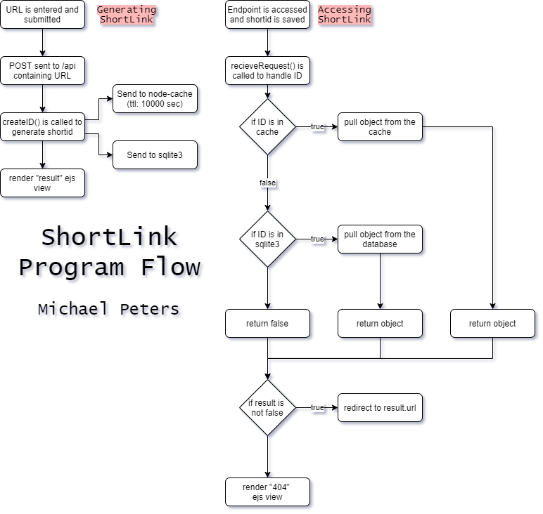

# ShortLink

 [](https://codeclimate.com/github/michaelpeterswa/ShortLink/maintainability)  

A simple link shortener built with express.js
> A link shortener that is used to redirect long links in a media acceptable format

## Demonstration
[](https://asciinema.org/a/YzNfwwjNwuBQVwKK2Xtwh5ZUL?autoplay=1&speed=2&rows=26)

## Diagram


## Installation
```
git clone https://github.com/michaelpeterswa/ShortLink.git
cd ShortLink
npm install
npm start

then go to localhost:6981/
```
Or download the file manually.
## Release History
* 1.0.0
   * Opened Repository (05.17.2020)
## Meta
Michael Peters - *michael@michaelpeterswa.com*

Distributed under the ____ license. See ``LICENSE`` for more information.
